<p align="center">
  
</p>

<h1 align="center">BoxPlayer</h1>

<p align="center">
  中文 · <a href="./README.en.md">English</a>
</p>

<p align="center">
  <strong>多网盘文件管理、媒体库、媒体服务器、AI Agent、音乐播放器和电子书阅读器，放在同一个跨平台桌面 App 里。</strong>
</p>

<p align="center">
  <a href="https://xbyvideohub.com/">官网</a>
  ·
  <a href="https://github.com/gaozhangmin/aliyunpan/releases">下载</a>
  ·
  <a href="./clouddrive-cli/README.md">clouddrive-cli</a>
  ·
  <a href="#开发">开发</a>
</p>

<p align="center">
  
  
  
  
  
</p>

---

## BoxPlayer 是什么

BoxPlayer 最初来自“小白羊网盘”的多网盘文件管理能力，现在已经演进成一个面向个人媒体资产的桌面工作台：

- 把阿里云盘、百度网盘、123 网盘、115、夸克、PikPak、OneDrive、Dropbox、Box、移动云盘、天翼云盘等云盘统一管理。
- 把网盘文件、本地文件夹、Jellyfin、Emby、Plex、WebDAV / AList 媒体源统一搜索、播放和整理。
- 用 AI 搜索公开资源、分析云盘、规划整理任务、辅助阅读 PDF / EPUB / 文档。
- 内置视频播放器、MPV/IINA 外部播放、Aria2 下载、音乐库、粒子播放器、桌面歌词、电子书书架和 AI 阅读器。
- 支持中文和英文界面，首次启动会根据系统语言自动选择；设置中也可以手动切换。

简单说：它不是只“打开一个网盘”，而是把你的云盘、媒体库、下载器、播放器和 AI 助手缝成一个完整的个人影音/阅读控制台。

---

## 目录

- [界面预览](#界面预览)
- [核心能力](#核心能力)
- [文档 AI](#文档-ai)
- [支持的云盘与媒体源](#支持的云盘与媒体源)
- [AI 与 Pro 功能](#ai-与-pro-功能)
- [clouddrive-cli](#clouddrive-cli)
- [安装](#安装)
- [开发](#开发)
- [项目结构](#项目结构)
- [赞助与社区](#赞助与社区)
- [鸣谢](#鸣谢)
- [免责声明](#免责声明)

---

## 界面预览

### 网盘首页与文件库

<p>
  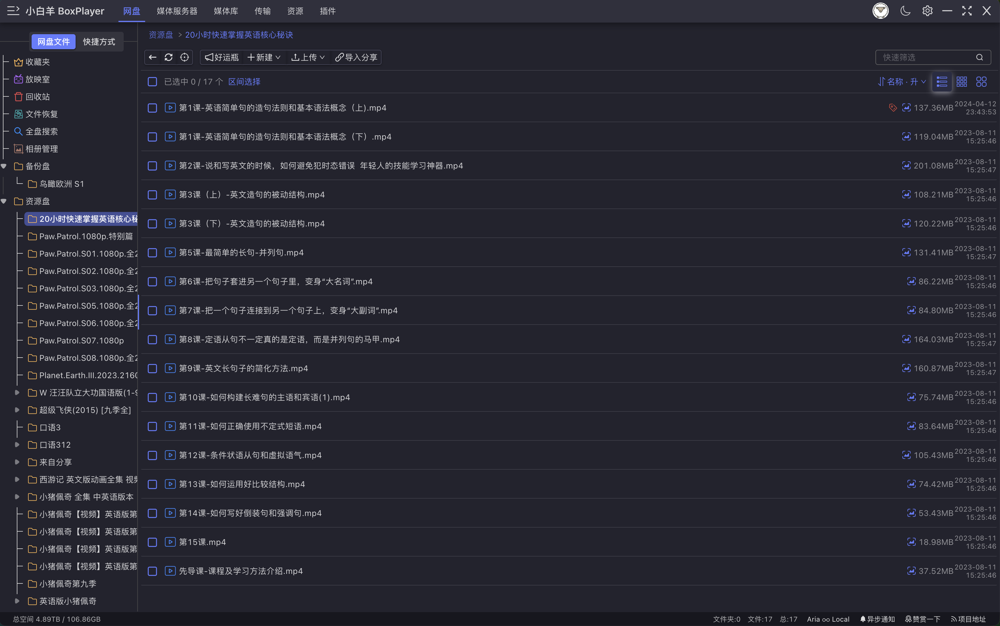
  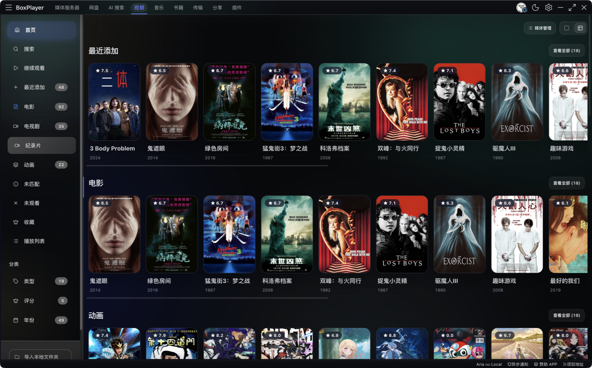
</p>

### 全局搜索与 AI 搜索

<p>
  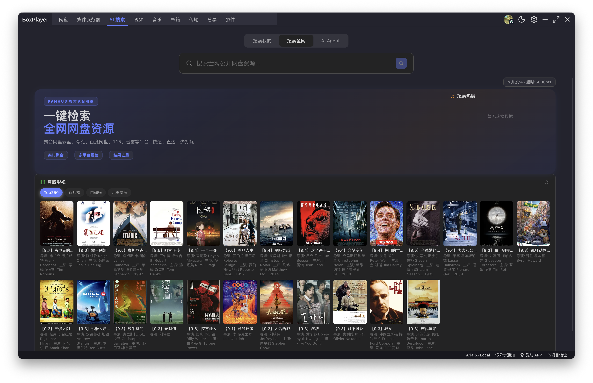
  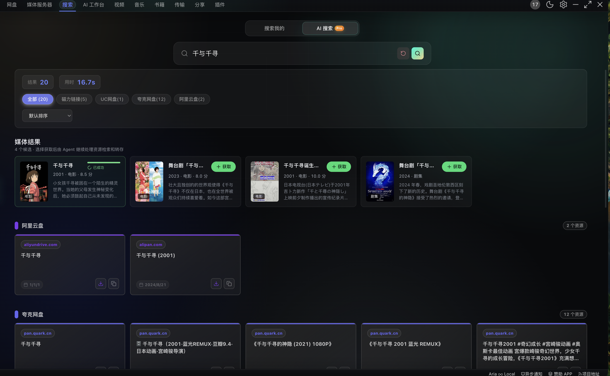
</p>

### AI Agent 媒体获取与追更

<p>
  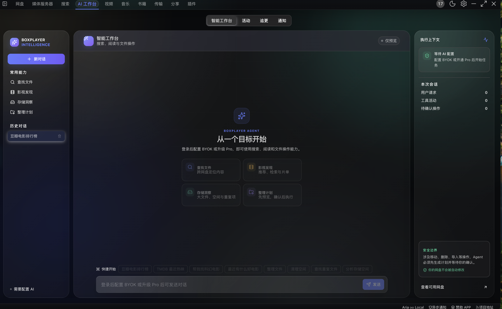
  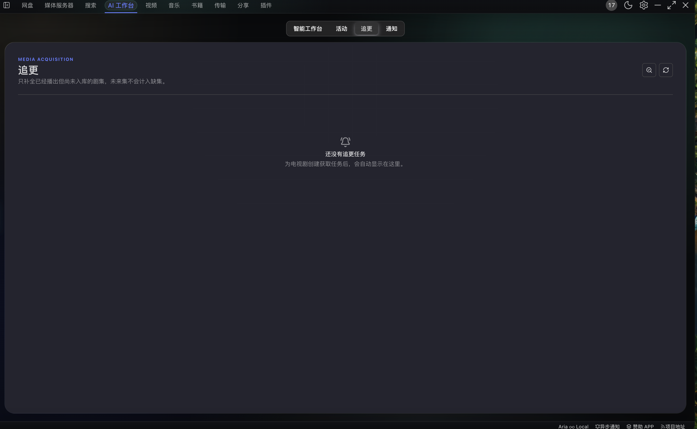
</p>

### 文档 AI：单文件问答与多文档对话

<p>
  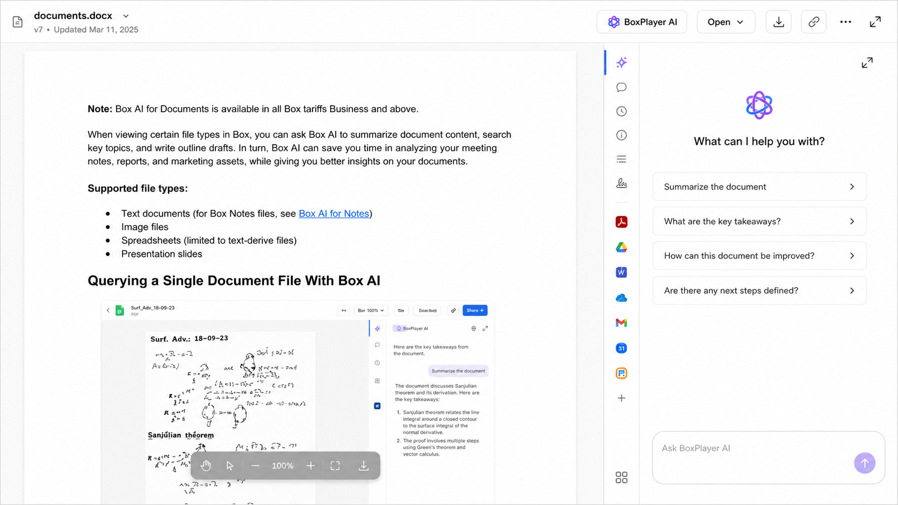
  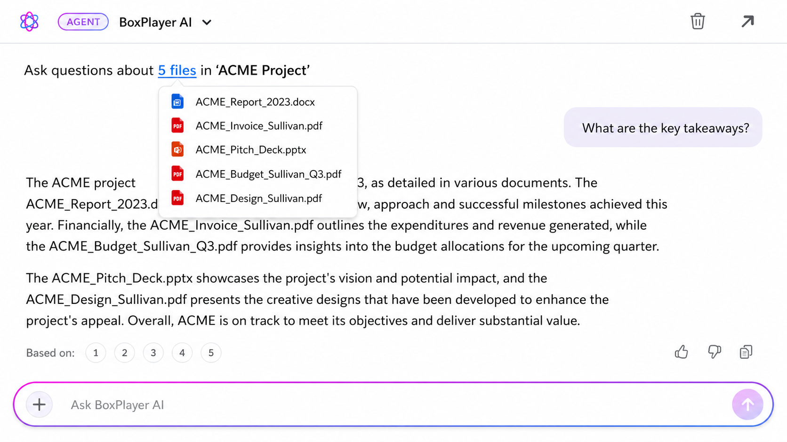
</p>

### 媒体服务器

<p>
  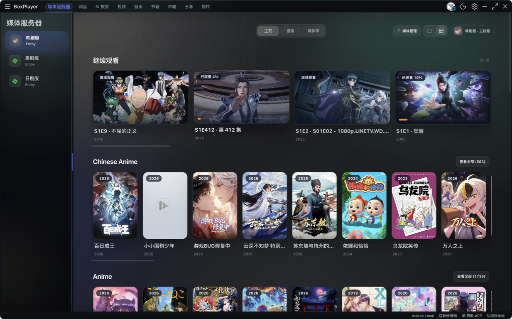
  
</p>

<p>
  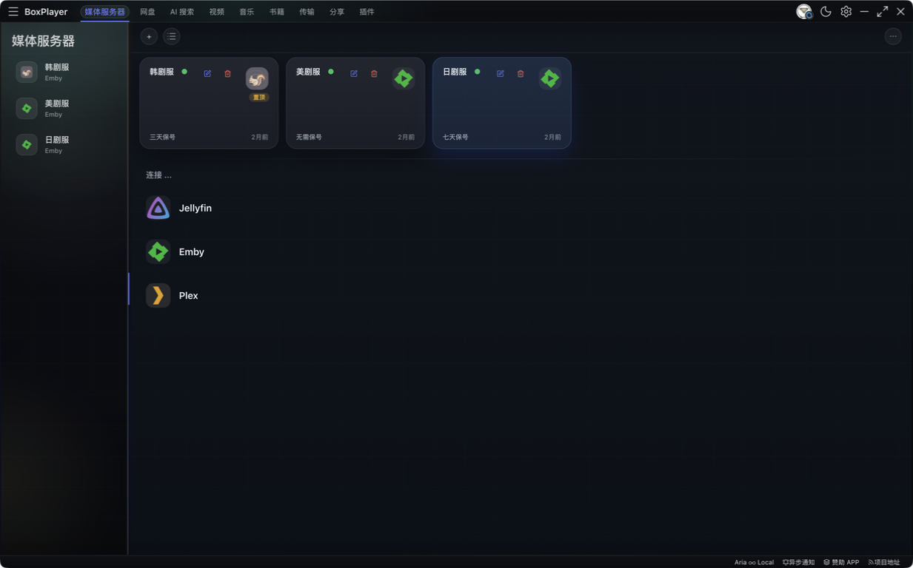
  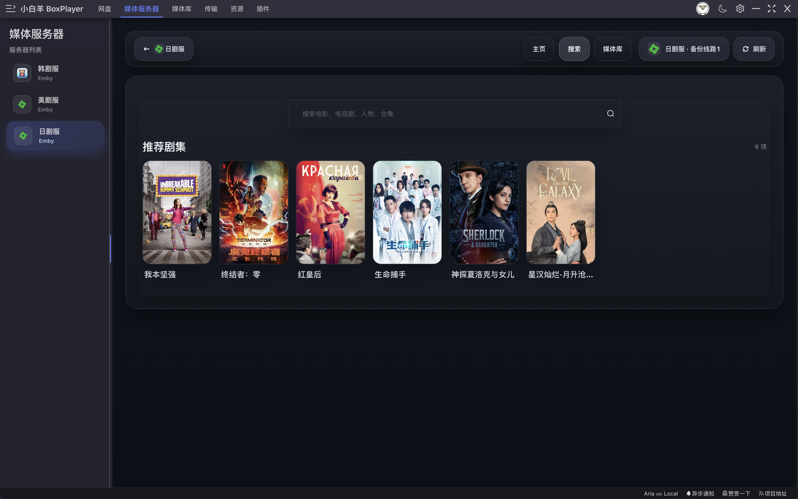
</p>

### 音乐库与粒子播放器

<p>
  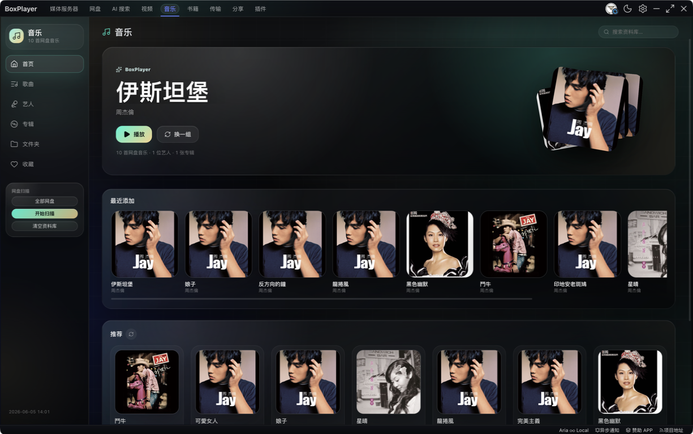
  
</p>

### 书籍库与 AI 阅读器

<p>
  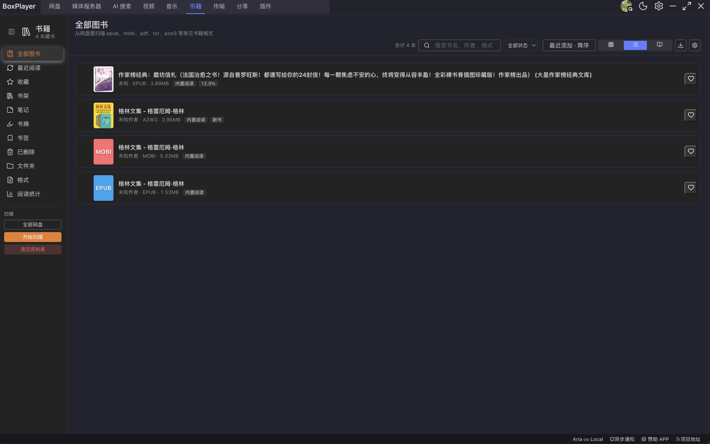
  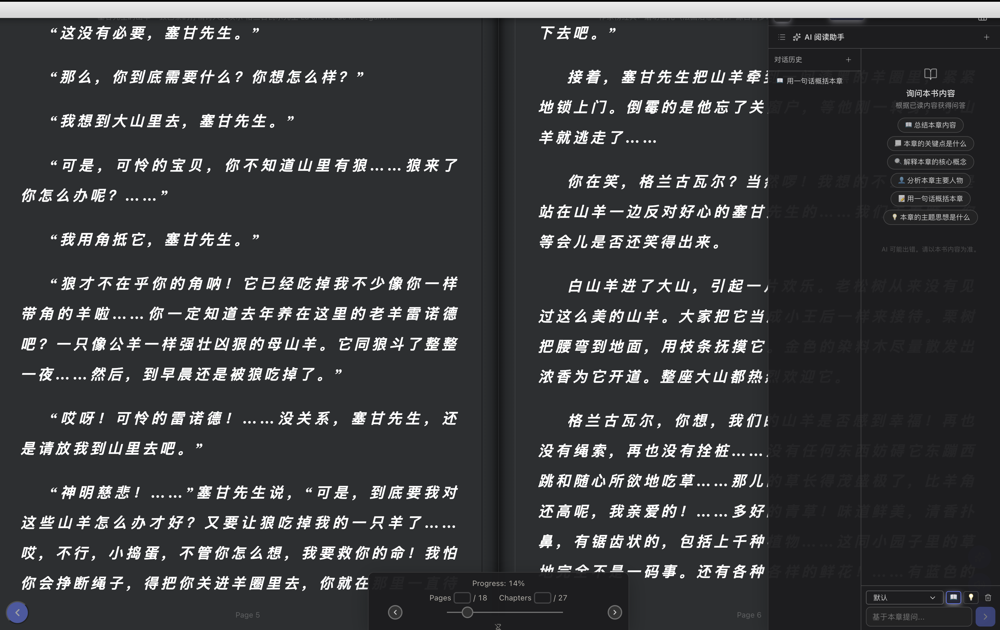
</p>

### 支持与反馈

<p>
  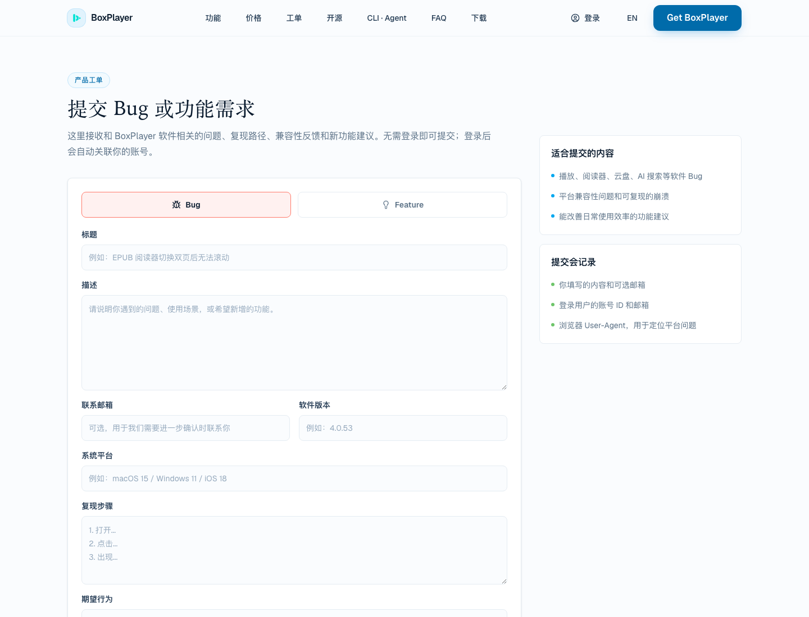
</p>

---

## 核心能力

### 1. 多网盘文件管理

- 多账号登录与统一侧边栏管理。
- 文件夹树、收藏、回收站、相册、全盘搜索、快捷拖拽、批量选择。
- 上传、下载、新建文件/文件夹、重命名、复制、移动、删除、分享。
- 适配第三方云盘能力边界：不支持的操作不会错误回落到阿里云盘接口。
- 支持按名称、时间、大小、数量等排序，适合大目录和海量文件管理。

### 2. 云盘媒体库

- 扫描云盘、本地目录和第三方媒体源，建立电影、电视剧、动漫、纪录片等媒体资料库。
- 结合 TMDB / 豆瓣等元数据生成海报、年份、评分、简介、季集信息。
- 支持媒体整理：按影视命名规则归类、移动、拆目录、补全季集。
- 同目录字幕、同目录播放列表、跨网盘媒体扫描均走对应云盘 API。

### 3. 媒体服务器客户端

- 支持 Jellyfin、Emby、Plex。
- 首页聚合继续观看、下一集、最近添加和各媒体库分区。
- 支持媒体服务器内搜索、合集、人物、类型、工作室、剧集详情和播放进度同步。
- 支持自定义服务器图标、多线路切换、媒体库首页分区排序和显示控制。
- 支持根据设备配置、码率、兼容性策略请求服务器播放地址。

### 4. 视频播放

- 内置 Web 播放器，支持 HLS / DASH / 常见直链播放。
- 支持 MPV 内嵌/外部播放、IINA 等第三方播放器。
- 支持清晰度切换、多音轨、外挂字幕、双字幕、ASS/SSA、字幕偏移、字幕繁简转换。
- 支持在线字幕搜索、在线弹幕搜索、同目录字幕自动加载。
- 支持长按倍速、自动跳片头片尾、自动连播、历史进度跳转。

### 5. 下载与传输

- 集成 aria2c 下载引擎，支持 HTTP、BT、磁力和远程 Aria2。
- 支持 tracker 同步、UPnP 端口映射、任务详情、完成通知、Dock / 任务栏进度。
- 支持协议捕获：`magnet://`、`mo://` 等可直接拉起下载任务。
- 支持上传/下载批量任务、速度限制、自动恢复未完成任务。

### 6. 音乐库与沉浸式播放器

- 扫描网盘音乐，按歌曲、艺人、专辑、文件夹、收藏、最近播放组织。
- 粒子舞台、实时频谱、封面取色、3D 歌单架、视觉控制台。
- 10 段 EQ、混响、声像、变调不变速、节拍分析和本地缓存。
- 支持歌词检索、自定义歌词、逐行/逐字高亮、桌面悬浮歌词窗口。
- 支持本地歌单、播客候选识别、主题和视觉预设导入导出。

### 7. 书籍库与阅读器

- 扫描云盘和本地书籍，支持 EPUB、PDF、TXT、MOBI、AZW3、DOCX、Markdown 等常见格式。
- 书架、收藏、最近阅读、阅读状态、回收站、格式/文件夹维度浏览。
- 阅读器支持单页、双页、滚动模式，支持高亮、笔记、书签、图片预览。
- 支持导出笔记/高亮/书签。
- AI 阅读助手可对当前文档总结、问答、翻译，并按引用内容回答。

### 8. AI 工作台

- 自然语言搜索网盘、媒体服务器和公开资源。
- 支持查重、空间分析、文件分类、移动整理、媒体整理、导出直链、导入分享等工具化操作。
- 写入类操作会先展示确认信息；删除、移动、整理、导入等不会静默执行。
- 支持长期偏好记忆，但不会保存密码、token、密钥等敏感内容。
- 活动、通知、追更记录和 Agent 任务状态在工作台中统一查看。

### 9. 文档 AI

- 在 PDF、EPUB、TXT、Markdown、DOCX 等支持的文档预览中，点击 **BoxPlayer AI / 用 AI 分析** 即可针对当前文件提问。
- 在网盘文件列表、文件夹、搜索结果中多选支持的文档后，可在同一个对话中进行跨文档总结、比较和问答；一次最多添加 10 份来源。
- 内置“总结这些来源”“有哪些关键要点？”“这份文档可如何改进？”“这些文档定义了哪些下一步？”等快捷问题，也可直接输入具体问题并按 Enter 发送。
- 对话中的“＋”可逐级浏览当前网盘并批量添加文档；文件名全网搜索作为辅助入口。输入 `@文件名` 可引用已加入或当前范围内的文档，帮助明确提问对象。
- 支持切换到宽视图继续对话、清空当前会话、复制回答、提交有用/无用反馈；回答会附带可悬停查看的引用片段，并可跳回 PDF 对应位置。
- 文档会在本机解析、分块和建立索引；仅将检索到的相关片段用于回答。图片型 PDF 不做 OCR，无法提取文字时会明确提示。

### 10. 多语言

- 当前支持中文和英文。
- 首次启动会读取系统语言：系统语言为中文时使用中文，否则默认英文。
- 设置页可手动切换语言。
- 长英文标题和按钮文本支持悬浮提示显示全文，减少被省略后看不全的问题。

---

## 支持的云盘与媒体源

### 云盘

| 服务 | 浏览 | 搜索 | 下载/播放 | 上传 | 文件操作 | 分享 |
|---|---:|---:|---:|---:|---:|---:|
| 阿里云盘 / Alipan | ✅ | ✅ | ✅ | ✅ | ✅ | ✅ |
| 百度网盘 | ✅ | ✅ | ✅ | ✅ | ✅ | 部分 |
| 123 网盘 | ✅ | ✅ | ✅ | ✅ | ✅ | 部分 |
| 115 网盘 | ✅ | ✅ | ✅ | ✅ | ✅ | 部分 |
| 夸克网盘 | ✅ | ✅ | ✅ | ✅ | ✅ | ✅ |
| PikPak | ✅ | ✅ | ✅ | 部分 | 部分 | 部分 |
| OneDrive | ✅ | ✅ | ✅ | ✅ | ✅ | 部分 |
| Dropbox | ✅ | ✅ | ✅ | ✅ | ✅ | 部分 |
| Box | ✅ | ✅ | ✅ | ✅ | ✅ | 部分 |
| 中国移动云盘 139 | ✅ | ✅ | ✅ | ✅ | ✅ | 部分 |
| 天翼云盘 189 | ✅ | ✅ | ✅ | ✅ | ✅ | 部分 |
| 光鸭云盘 | ✅ | ✅ | ✅ | 部分 | 部分 | 部分 |

不同平台的官方能力、权限和账号类型不同，实际可用功能以 App 内按钮和错误提示为准。

### 媒体服务器与目录源

- Jellyfin
- Emby
- Plex
- WebDAV
- AList
- 本地文件夹

---

## AI 与 Pro 功能

BoxPlayer 保持核心客户端免费开源。多网盘文件管理、播放、下载、书籍阅读、音乐播放、媒体服务器客户端和 `clouddrive-cli` 仍可直接使用。

Pro 主要覆盖需要持续服务端成本的能力：

- BoxPlayer 内置 AI 模型。
- AI 搜索、语义索引和高级 Agent 媒体获取。
- 全网资源搜索更高额度。
- AI 阅读助手、文档分析、翻译、阅读器 AI 能力。
- 官网工单和优先支持。

也支持 BYOK（Bring Your Own Key）：登录后可以配置 OpenAI、DeepSeek、OpenRouter、Ollama、Vercel AI Gateway 等兼容服务，消耗你自己的第三方额度。

---

## clouddrive-cli

`clouddrive-cli` 是 BoxPlayer 面向终端和 AI Agent 的自动化入口，也可以作为 MCP Server 提供给 Claude Desktop、Cursor、Windsurf 等客户端。

主要能力：

- 遍历、搜索、统计云盘文件。
- 生成媒体重命名、移动、整理计划。
- dry-run 预览，再执行可追踪操作。
- 操作记录和撤销。
- MCP 工具 schema，让 AI 客户端安全调用。

在 App 中安装：

```text
BoxPlayer → 账户设置 → 安装命令行工具
```

独立安装：

```bash
npm install -g clouddrive-cli
```

示例：

```bash
clouddrive-cli files search --provider aliyun --name "Inception" --json
clouddrive-cli files tree --provider aliyun --file-id root --depth 3
clouddrive-cli organize analyze --provider aliyun --file-id root --summary --json
clouddrive-mcp
```

详细文档见 [clouddrive-cli/README.md](./clouddrive-cli/README.md)。

---

## 安装

### App Store

iOS / tvOS / macOS 可通过 App Store 安装：

[https://apps.apple.com/us/app/boxplayer/id6739804060](https://apps.apple.com/us/app/boxplayer/id6739804060)

### 桌面版

在 GitHub Releases 下载对应平台安装包：

[https://github.com/gaozhangmin/aliyunpan/releases](https://github.com/gaozhangmin/aliyunpan/releases)

| 平台 | 推荐文件 |
|---|---|
| macOS Apple Silicon | `*-mac-arm64.dmg` |
| macOS Intel | `*-mac-x64.dmg` |
| Windows | `*-win.exe` |
| Windows 免安装 | `*-win-x64.zip` / `*-win-arm64.zip` |
| Debian / Ubuntu | `*.deb` |
| Linux 通用 | `*.AppImage` |
| Arch / Manjaro | `*.pacman` |

macOS 如果提示“文件已损坏”或被 Gatekeeper 拦截，可在确认来源可信后执行：

```bash
sudo xattr -d com.apple.quarantine /Applications/xbyboxplayer.app
```

---

## 开发

### 环境要求

- Node.js >= 22.12.0
- pnpm
- macOS / Windows / Linux

本项目使用 pnpm，仓库内不要使用 npm 或 yarn 安装依赖。

### 安装依赖

```bash
pnpm install
```

### 本地开发

```bash
pnpm dev
```

### 类型检查与测试

```bash
CI=true pnpm exec vue-tsc --noEmit
pnpm run test
pnpm run test:clouddrive-cli
```

### 构建

```bash
pnpm run build
pnpm run build:electron
pnpm run build:mac
pnpm run build:linux
pnpm run build:windows
```

注意：`pnpm run build` 会执行 `version.mjs` 自动递增 patch version；只想做类型检查时请使用：

```bash
CI=true pnpm exec vue-tsc --noEmit
```

### 私有配置与密钥

真实 client id、client secret、API key 不提交到仓库。开发时使用：

```bash
pnpm run secrets:generate
```

本地读取 `.env.local` 并生成 `src/secrets.generated.ts`。这两个文件都应保持 ignored 状态。

---

## 项目结构

```text
electron/             Electron 主进程、窗口、协议、下载引擎、媒体获取服务
src/                  Vue 3 渲染端
src/aliapi/           统一云盘文件、下载、分享、上传、文件操作入口
src/cloud*/           各云盘 provider 实现
src/media-server/     媒体服务器内容网关和播放信息
src/layout/           主页面：网盘、视频、音乐、AI、阅读等
src/components/       通用组件和媒体库组件
src/setting/          设置页
shared/               主进程 / 渲染端 / CLI 共享代码
clouddrive-cli/       独立 CLI 与 MCP Server
scripts/              构建、密钥生成、发布辅助脚本
screenshot/           README 使用的截图资源
```

---

## 技术栈

- Electron 40
- Vue 3
- Vite
- TypeScript
- Arco Design Vue
- Dexie / SQLite / better-sqlite3
- ArtPlayer / MPV
- aria2c
- AI SDK / OpenAI-compatible providers

---

## 赞助与社区

如果 BoxPlayer 对你有帮助，欢迎赞助支持持续维护。

<p align="center">
  
  
</p>

USDT / USDC：

```text
0xb0a3f7254e97a8bd398b1ab7f70eb48b0dc68eaf
```

微信公众号：

<p align="center">
  
</p>

Telegram：

[https://t.me/+wjdFeQ7ZNNE1NmM1](https://t.me/+wjdFeQ7ZNNE1NmM1)

---

## 鸣谢

本项目基于 [liupan1890/aliyunpan](https://github.com/liupan1890/aliyunpan) 继续开发，感谢原作者和社区贡献。

全网搜索能力部分来自 [panhub.shenzjd.com](https://github.com/wu529778790/panhub.shenzjd.com) 相关生态。

---

## 免责声明

1. 本项目为学习、研究和个人文件管理用途，请遵守所在地区法律法规以及各平台服务条款。
2. 本项目通过公开接口、官方接口或用户授权方式访问服务，不鼓励也不支持滥用账号、绕过限制或侵犯版权的行为。
3. 用户应自行确认文件来源、分享链接、下载内容和媒体资源的合法性。
4. 使用第三方云盘、媒体服务器、AI 服务和下载服务产生的账号风险、额度消耗、限速、封禁或费用由用户自行承担。
5. 如有侵权或合规问题，请通过官网支持渠道或 GitHub Issue 联系处理。
