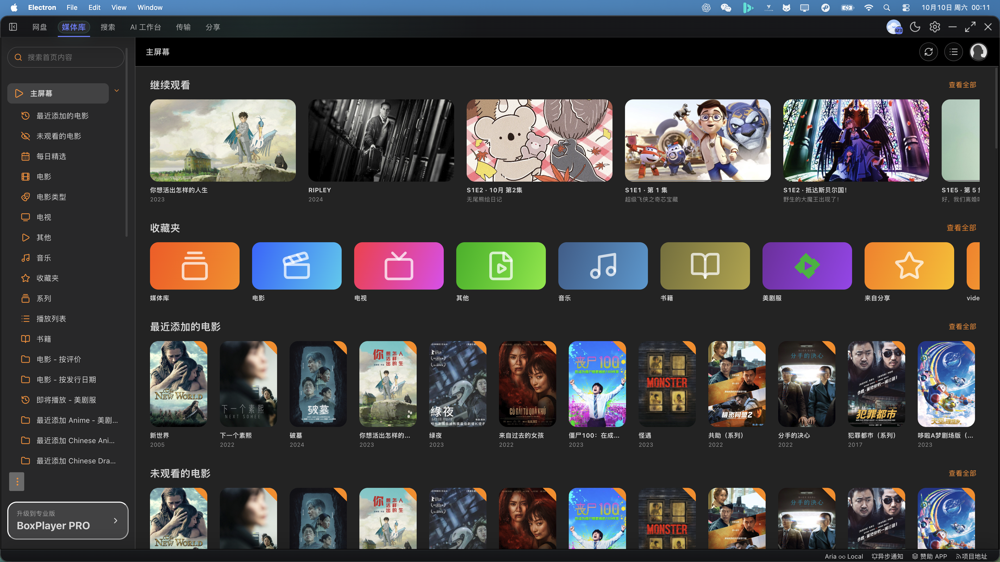
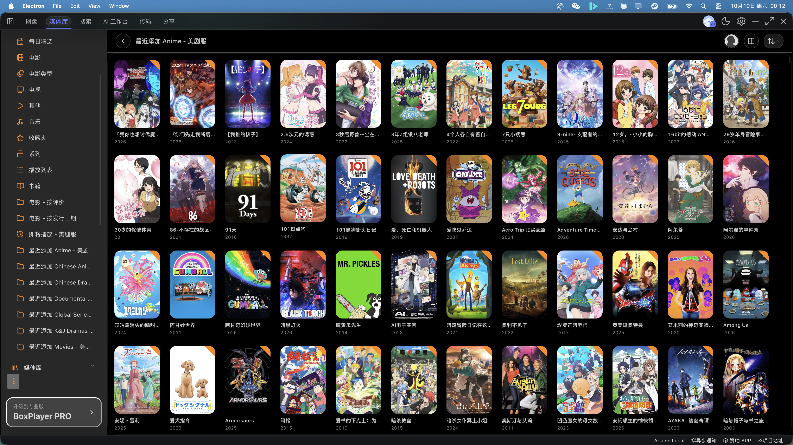
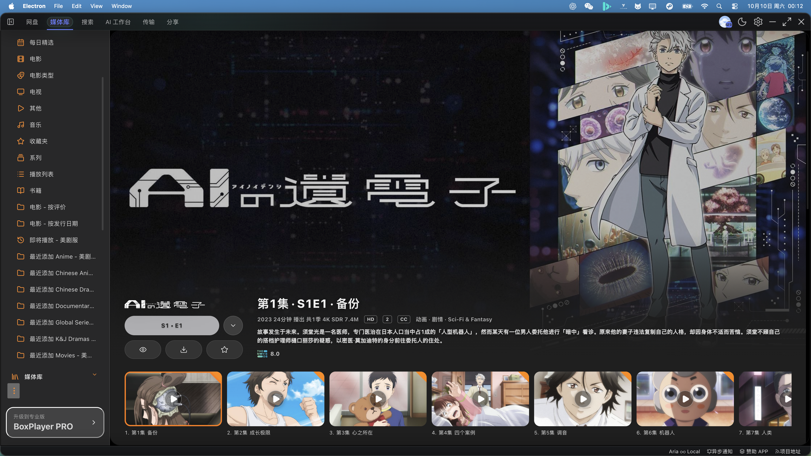
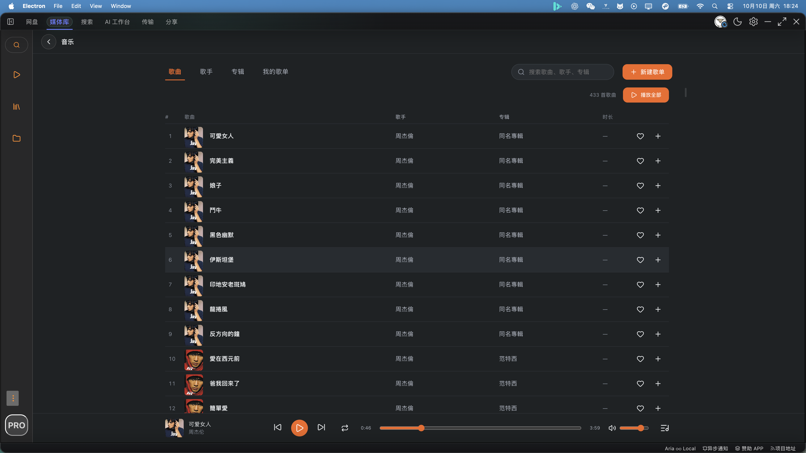
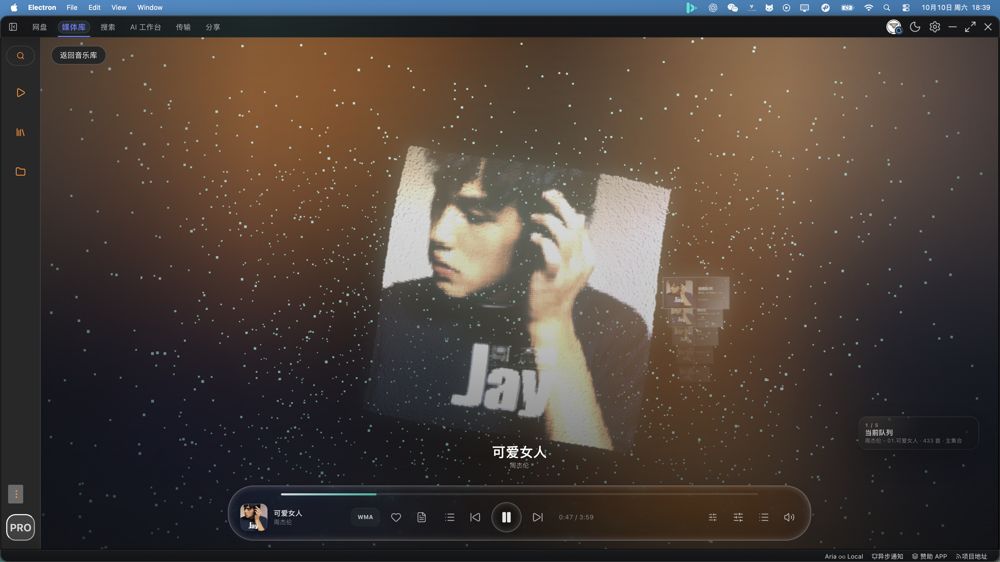
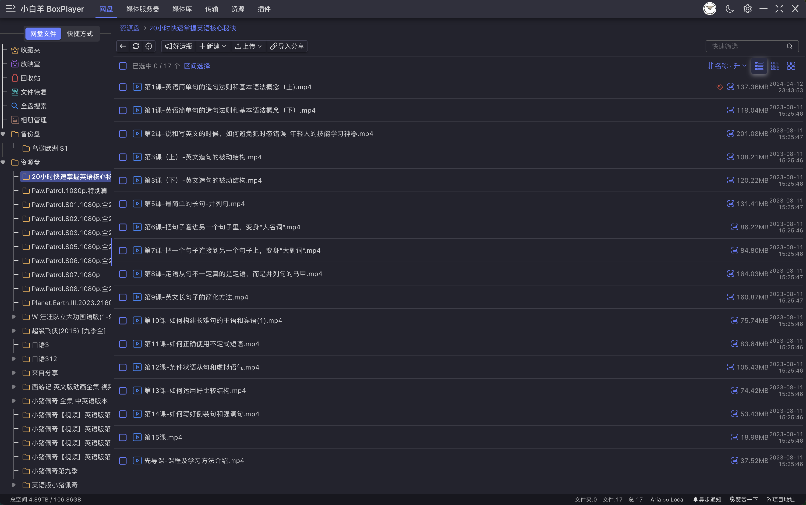
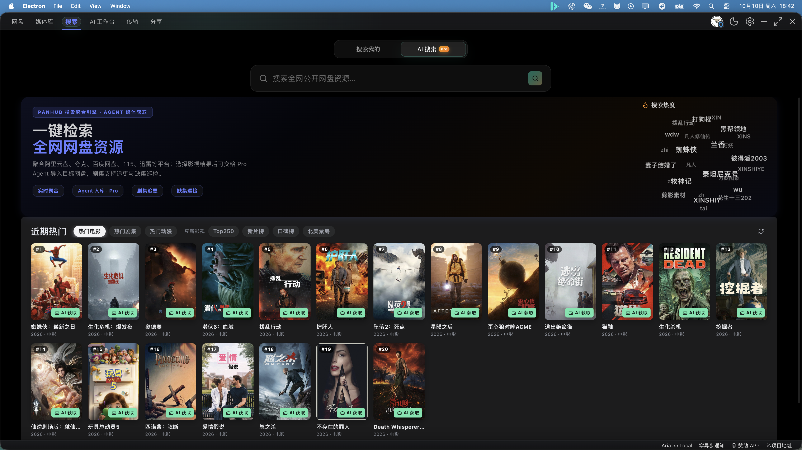
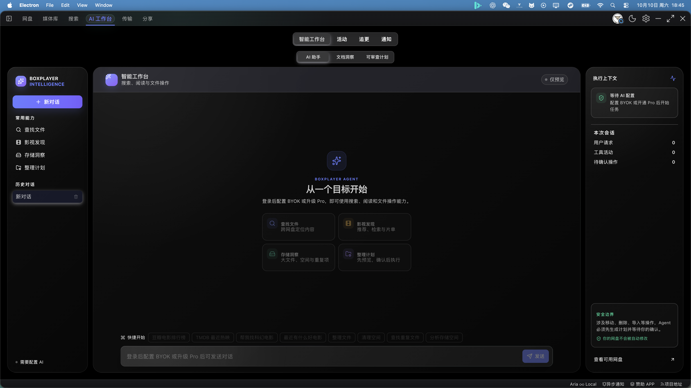
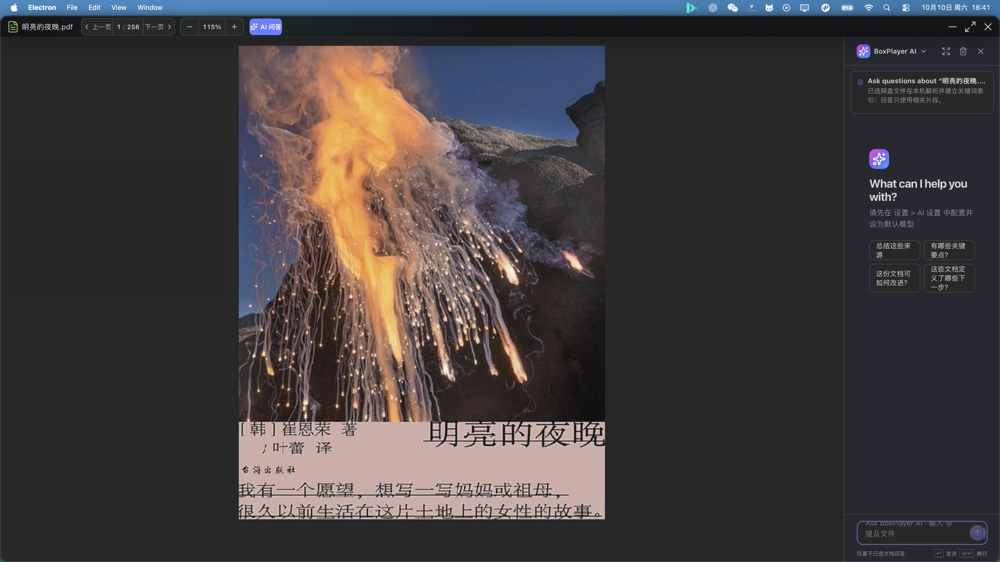

<p align="center"></p>

# BoxPlayer

<p align="center">跨手机、平板、电视与电脑的全平台播放器：把网盘、媒体服务器、音乐、阅读与 AI 放进同一个入口。</p>

<p align="center">
  中文 · <a href="./README.en.md">English</a> ·
  <a href="https://xbyvideohub.com/">官网及全平台下载</a> ·
  <a href="https://github.com/gaozhangmin/boxplayer/releases">桌面版 Releases</a> ·
  <a href="./clouddrive-cli/README.md">CLI / MCP</a>
</p>

BoxPlayer 是面向个人媒体资产的全平台播放器，支持 Apple 全家桶（iPhone、iPad、Mac、Apple TV）、Windows、Linux、Android 手机与平板，以及 Android TV。它把多个云盘、本地文件和 Jellyfin / Emby / Plex 内容放在统一入口中，支持文件管理、媒体刮削与播放、音乐库、电子书阅读及 AI 辅助操作。本仓库主要维护 Electron 桌面版；各平台客户端的界面、功能与发布节奏可能不同。

> 第一次使用？前往 [安装](#安装)，添加云盘或媒体服务器，然后在媒体库扫描内容。版本变更与已知限制见 [v5.0.36 更新说明](docs/releases/v5.0.36.md)。

## 界面预览

### 统一媒体库

主屏幕汇集继续观看、收藏夹和媒体分类；详情页展示背景图、季集、演职员与播放进度。



<p>
  
  
</p>

### 音乐库与粒子播放器

按歌曲、歌手、专辑和自建歌单浏览；从音乐库播放后可进入粒子播放器，也能返回列表继续管理曲目。

<p>
  
  
</p>

### 文件、搜索与 AI

云盘文件管理与跨来源搜索共用一个工作区。AI 功能可辅助寻找媒体、整理文件和阅读文档。

<p>
  
  
</p>

<p>
  
  
</p>

更多画面：[本地搜索](screenshot/search_local.png) · [书架](screenshot/book_home.png) · [阅读器](screenshot/book_reader.png) · [AI 阅读](screenshot/book_reader_ai.png)

## 能做什么

| 场景 | 主要能力 |
|---|---|
| 文件管理 | 多账号云盘浏览、搜索、上传下载、复制移动、分享与回收站；第三方云盘按其 API 能力展示操作。 |
| 影视媒体库 | 扫描云盘和本地目录，补全海报与元数据；统一浏览电影、剧集、季集、演员和分类。 |
| 媒体服务器 | 连接 Jellyfin、Emby、Plex，浏览媒体库、继续观看、搜索并播放。 |
| 视频播放 | 内置播放器与 MPV / IINA 外部播放；支持音轨、字幕、ASS/SSA、倍速、连续播放和进度恢复。 |
| 音乐 | 歌曲、歌手、专辑、自建歌单与播放队列；粒子播放器、歌词、音效和桌面歌词。 |
| 阅读 | EPUB、PDF、TXT 等电子书；书签、笔记、高亮与 AI 阅读辅助。 |
| AI 工作台 | 搜索与分析内容、规划文件整理、文档问答；执行写入操作前提供确认。 |
| 自动化 | `clouddrive-cli` 和 MCP Server，适合终端及 AI Agent 调用云盘能力。 |

### 云盘与内容来源

- 云盘：阿里云盘 / Alipan、百度网盘、123 网盘、115、夸克、PikPak、OneDrive、Dropbox、Box、中国移动云盘 139、天翼云盘 189、光鸭云盘。
- 媒体与目录：Jellyfin、Emby、Plex、WebDAV、AList、本地文件夹。
- 不同服务的官方能力、账号权限和限速可能不同。App 会尽量只展示当前来源支持的操作。

### AI 与 Pro

核心的文件管理、媒体播放、音乐、阅读和 CLI 功能可直接使用。Pro 主要覆盖需要持续服务端成本的内置 AI、资源搜索额度与优先支持。也可以配置自己的 OpenAI 兼容服务或本地模型；第三方 API 费用由对应服务商收取。

### 命令行与 MCP

`clouddrive-cli` 提供文件遍历、搜索、媒体整理计划、dry-run 预览、操作记录等能力，并能作为 MCP Server 供 AI 客户端使用。详见 [独立文档](./clouddrive-cli/README.md)。

## 安装

**官网：[xbyvideohub.com](https://xbyvideohub.com/)**，在「全部下载」中选择设备对应的版本：

| 设备 | 下载入口 |
|---|---|
| iPhone、iPad、Mac、Apple TV | [BoxPlayer App Store](https://apps.apple.com/us/app/boxplayer/id6739804060) |
| Android 手机、平板、Android TV | [官网 Android APK 下载](https://xbyvideohub.com/) |
| macOS、Windows、Linux 桌面版 | [官网下载安装包](https://xbyvideohub.com/) · [GitHub Releases](https://github.com/gaozhangmin/boxplayer/releases) |

请以下载页面实际列出的文件和架构为准；GitHub 草稿 Release 尚不能作为公开下载版本。Apple 平台 App Store 版与本仓库的 Electron 桌面版是不同客户端。

macOS 如遇系统安全提示，请先确认下载来源，再通过系统设置允许打开；不要对来源不明的安装包解除隔离。

## 开发

要求 Node.js >= 22.12.0，使用 **pnpm** 管理依赖。

```bash
pnpm install
pnpm dev
```

检查与构建：

```bash
CI=true pnpm exec vue-tsc --noEmit
pnpm run test
pnpm run test:clouddrive-cli
pnpm run build
```

`pnpm run build` 会先通过 `version.mjs` 自动递增 patch 版本，再进行类型检查和打包；只需检查类型时请运行上面的 `vue-tsc` 命令。平台打包命令见 `package.json`。

私有 client ID、secret 和 API key 放在忽略提交的 `.env.local` 中，运行 `pnpm run secrets:generate` 生成 `src/secrets.generated.ts`。不要提交真实凭据。

```text
electron/          主进程、窗口与系统集成
src/               Vue 界面、云盘与媒体功能
shared/            主进程与渲染端共享代码
clouddrive-cli/    CLI 与 MCP Server
scripts/           构建、密钥与发布脚本
screenshot/        README 使用的当前界面截图
```

## 社区与声明

- 问题与建议：[GitHub Issues](https://github.com/gaozhangmin/boxplayer/issues)
- 官网：[xbyvideohub.com](https://xbyvideohub.com/)
- Telegram：[BoxPlayer 社区](https://t.me/+wjdFeQ7ZNNE1NmM1)
- 本项目基于 [liupan1890/aliyunpan](https://github.com/liupan1890/aliyunpan) 继续开发，感谢原作者及贡献者。

请遵守所在地区法律法规、各云盘及媒体服务的条款，并确认自己有权访问和使用相关内容。第三方服务产生的额度消耗、费用与账号风险由使用者自行承担。
