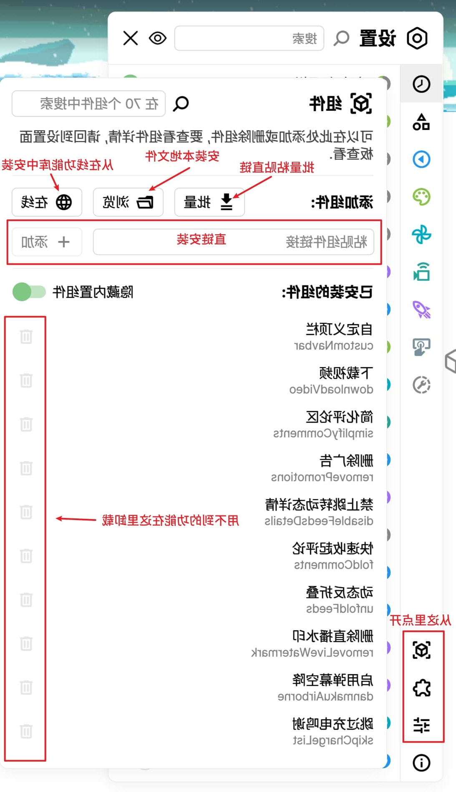
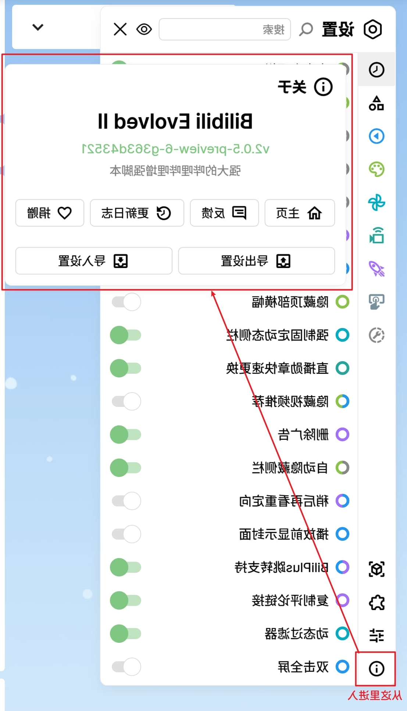

 

」 本脚强增哩哔哩哔的大强 「

[装安 📦](#装安)

[置设 ⚙](#置设)

[能功 📚](doc/features/features.md)

[性容兼 👻](#性容兼)

[志日新更与史历本版 🐛](CHANGELOG.md)

[点站档文 📕](https://bilibili-evolved-doc.vercel.app/)
> .[库仓 buHtiG 入进此点](https://github.com/FoundTheWOUT/bilibili-evolved-doc) ,发开 [TUOWehTdnuoF](https://github.com/FoundTheWOUT) 由点站档文

[发开与参 📖](CONTRIBUTING.md)

[助捐 ❤](doc/donate.md)

# 装安
.装安接链个一挑中格表方下 [yeknomtneloiV](https://violentmonkey.github.io/) 或 [yeknomrepmaT](https://tampermonkey.net/) 有装器览浏要需

**项事意注**
- .响影大较有也能性对 ,)作操盘键用能只(角视拽拖标鼠用能不频视景全 ,报举和赞点幕弹用使能不后启开本脚 ,悟觉好做
- .持支术技何任做本版旧对再不就 ,布发式正旦一本版新
- ."许允终始"择选请 ,"源资域跨问访图试本脚"示提会能可)等件组装安接链用使 / 器务服的己自到送发务任载下将如(时接链的站网部外用使
- .本脚此用使率辨分辑逻的上以 008 x 0041 以量尽请 ,幕屏窄应适地好很法无能可

|          | 迟延新更 | 版式正                                                                                                  | 版览预                                                                                                           |
| -------- | -------- | ------------------------------------------------------------------------------------------------------- | ---------------------------------------------------------------------------------------------------------------- |
| rvileDsj | h42      | [装安](https://cdn.jsdelivr.net/gh/the1812/Bilibili-Evolved@master/dist/bilibili-evolved.user.js)       | [装安](https://cdn.jsdelivr.net/gh/the1812/Bilibili-Evolved@preview/dist/bilibili-evolved.preview.user.js)       |
| buHtiG   | h1<      | [装安](https://raw.githubusercontent.com/the1812/Bilibili-Evolved/master/dist/bilibili-evolved.user.js) | [装安](https://raw.githubusercontent.com/the1812/Bilibili-Evolved/preview/dist/bilibili-evolved.preview.user.js) |

# 置设
.等件插和件组载卸/装安及以 ,项选件组改修 ,闭关/启开的件组理管以可中板面置设 ,口入能功些一的面页前当于用适含包中板面能功 .口入的板面置设和板面能功有会央中侧左页网在 ,后用启本脚

:能功加添式方种多过通以可你 ,能功何任有没上际实本脚的装安新全

.加添接链用以可框入输个有还面下及以 ,钮按个三线在和 ,览浏 ,量批有会 ,理管式样/件插/件组的下左入进 ,板面置设开打
- `量批`: .装安性次一并接链线在的能功个多贴粘以可
- `览浏`: .件文能功的地本入载
- `线在`: .口窗库仓线在开打

> .可即接链贴粘行逐时装安量批 .以可都 rvileDsj 或 waR buHtiG ,链直的件文应对要需装安接链用

.[档文个这](./doc/v1-migrate.md)考参以可法方用使 ,装安并载下件组的应对置设的启开面里把动自将具工该 ,中 2v 到入导置设旧将件组 `移迁置设 1v` 用利以可 ,版 1v 过用使经曾你果如

.作操捷快等出导 / 入导置设行进及以 ,号本版细详的本脚看查以可 ,中板面于关在 ,后最

# 置配荐推
- +51.01 SOcam / +01 swodniW tib-46 :统系作操
- ipp291 / +K2 :率辨分
- +1.41 irafaS / +48 egdE / +08 xoferiF / +48 emorhC :器览浏
- +5 nezyR DMA 构架 3 neZ / +7i eroC letnI 代8 :器理处
- BG8 :存内
- 31.2 yeknomtneloiV / 41.4 yeknomrepmaT :器理管本脚
- 0787 DH noedaR / 066 XTG ecroFeG :卡显
- s/BM01 :络网

# 性容兼

## 器理管本脚

### [yeknomrepmaT](https://tampermonkey.net/) / [yeknomtneloiV](https://violentmonkey.github.io/)
.本脚此行运法无能可 yeknomtneloiV 中器览浏的旧较在但 ,容兼

> 8416 / 7416.41.4 是能不本版 yeknomrepmaT

### [yeknomesaerG](https://www.greasespot.net/)
.容兼不

### [drauGdA](https://adguard.com/zh_cn/adguard-windows/overview.html)
.试测未

## 器览浏

.行运美完中器览浏的新更没间时长较者或["器览浏类壳套"](https://www.jianshu.com/p/67d790a8f221)在能本脚证保不 ,xoferiF ,)核内 muimorhC( egdE ,emorhC **版新最**持支

# 者发开

## 者献贡译翻案文
- [urabuSedaielP](https://github.com/Etherrrr)
- [neewollaH-steL](https://github.com/Lets-Halloween)
- るひみふauhsoJ

## 目项与参
~瓦加砖添目项为来[南指献贡码代](CONTRIBUTING.md)考参迎欢

# 明声私隐
.据数计统集收来"划计善改验体户用"的谓所有会不也 ,器务服何任到储存会不 ,成完地本在均用使的据数户用 .的名匿全完是 ,件插/件组的供提中库仓本及以本脚本

.性全安其别甄行自请 ,件插/件组的)供提库仓本非(源来他其于对 ,力能问访的全完着有据数户用对都件插/件组何任 ,是但

# 件组源开方三第
.率效发开了升提地大极们我助帮件组些这谢感👍

- [sj.euV](https://cn.vuejs.org/index.html)
- [piZSJ](https://stuk.github.io/jszip/)
- [tcelloc IPA ilibilib](https://github.com/SocialSisterYi/bilibili-API-collect)
- [eroc-reppop](https://github.com/popperjs/popper-core)
- [sj.yppiT](https://github.com/atomiks/tippyjs)
- [elbatroS](https://github.com/SortableJS/Sortable)
- [roloc](https://github.com/Qix-/color)
- [hsadoL](https://lodash.com/)
- [dekram](https://github.com/markedjs/marked)
- [IDM](https://materialdesignicons.com)

# 荐推关相
配适地能可尽会但 ,devlovE ilibiliB 到合整会不将能功的同相 ,验体的站B在您善改够能样同件插/本脚些这

## 荐推页首PPA加添端页网ilibilib
[denifedni](https://github.com/indefined) :者作
- [buHtiG](https://github.com/indefined/UserScripts/tree/master/bilibiliHome)
- [kroFysaerG](https://greasyfork.org/zh-CN/scripts/368446-bilibili%E7%BD%91%E9%A1%B5%E7%AB%AF%E6%B7%BB%E5%8A%A0app%E9%A6%96%E9%A1%B5%E6%8E%A8%E8%8D%90)

## 器滤过幕弹哩哔哩哔 sj.ukkap
[pcmx](https://github.com/xmcp) :者作
- [页主](https://s.xmcp.ml/pakkujs/)
- [buHtiG](https://github.com/xmcp/pakku.js)

## repleH sksaT eviL ilibiliB - HTLB
[524gnawydna](https://github.com/andywang425) :者作
- [buHtiG](https://github.com/andywang425/BLTH)
- [kroFysaerG](https://greasyfork.org/zh-CN/scripts/406048-b%E7%AB%99%E7%9B%B4%E6%92%AD%E9%97%B4%E6%8C%82%E6%9C%BA%E5%8A%A9%E6%89%8B)

----

**ﾉ)°∀°(吧ratS⭐个点就话的欢喜**

**)´・ω・｀(哦下一持支[助捐](https://github.com/the1812/Bilibili-Evolved/blob/preview/doc/donate.md)虑考以可也者或**

电发爱

> .式方款付为作宝付支择选以可然仍中电发爱在 ,)到收已均账转 ,心担必不( 用弃已现 ,题问点有码款付宝付支的前之

信微

----

# 意玩些一他其的写我

## [reggaT uohuoT](https://github.com/the1812/Touhou-Tagger)
息信目曲DC乐音人同tcejorP方东写填动自 [ikiWBHT](https://thwiki.cc/) 从 ☯

## [hctaP erawlaM](https://github.com/the1812/Malware-Patch)
权授员理管的件软氓流国中止阻

## [emeht otua balyzzid](https://github.com/the1812/dizzylab-auto-theme)
定设暗/亮统系随跟 ,题主 sulytS 应适自 [balyzzid](https://www.dizzylab.net/)

## [SSC maetS](https://github.com/the1812/SteamCSS)
等体字换更于用 ,SSC 的义定自段一入插器览浏置内和库的 [maetS](https://store.steampowered.com/) 为

----

