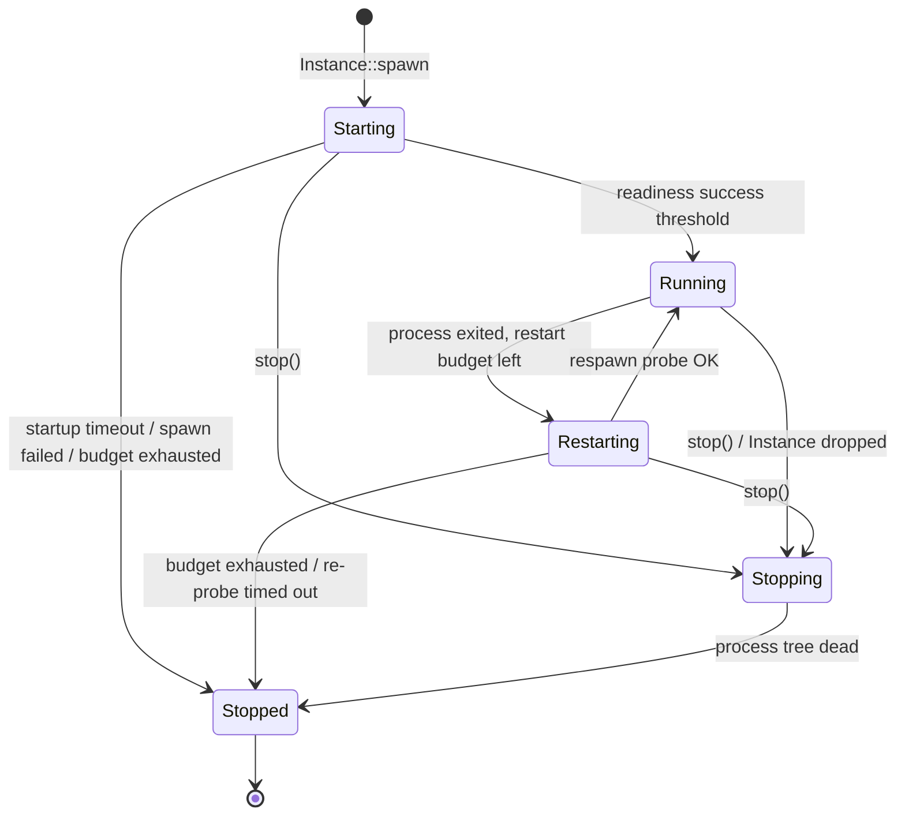
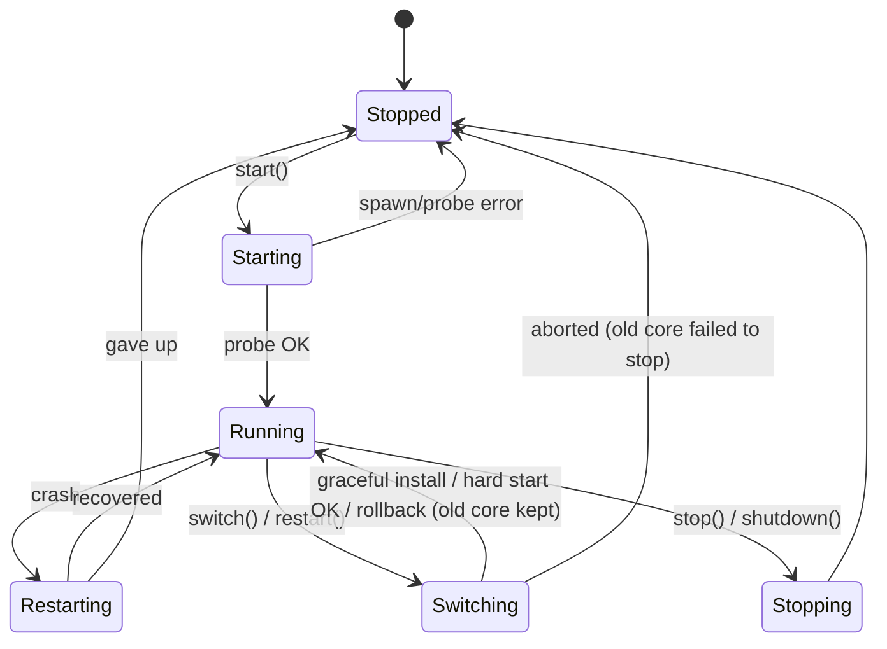
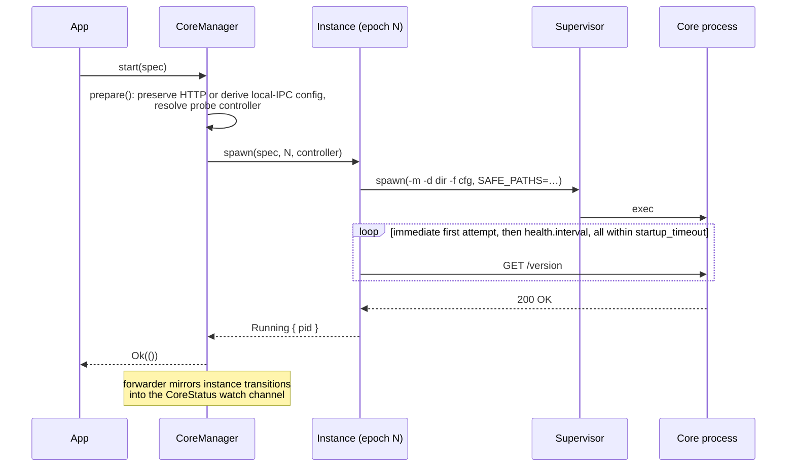
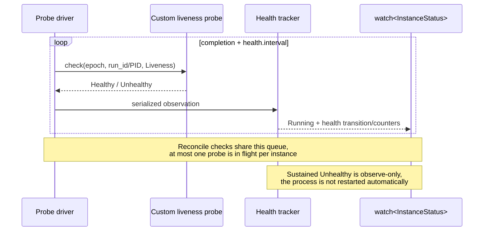
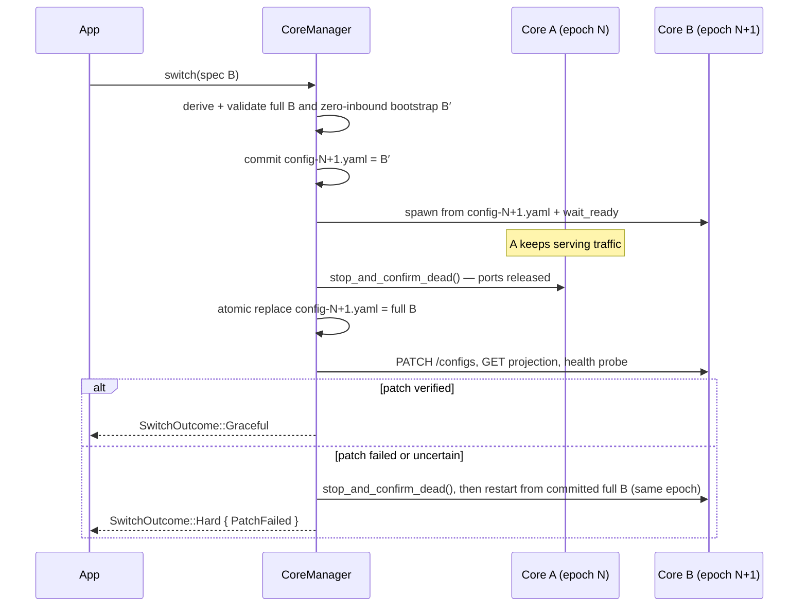

# nyanpasu-core-manager

Clash core lifecycle management: epoch-based instances, health-probed startup,
crash recovery, and hitless core switching.

The crate manages a proxy core process (mihomo, `CoreKind::ClashRust`, …) as an immutable,
single-epoch `Instance`, and layers a `CoreManager` on top that owns
start/stop/switch orchestration and publishes a unified `CoreStatus` snapshot
over a `watch` channel.

Key concepts:

- **Epochs and revisions** — an epoch is one process/controller lineage. A
  `ConfigRevision` identifies desired config within that epoch by generation
  and semantic hashes. Fully expressible changes can PATCH or reload the
  current epoch; switch-class changes allocate a new epoch.
- **Manager-owned snapshots** — every controller policy runs from a private,
  stable `config-{epoch}.yaml`, never directly from the caller's mutable file.
  Supervisor respawns therefore reload the committed desired revision.
- **Health-probed startup and runtime status** — a start is only confirmed once
  its readiness probe passes. The default is `GET /version`; custom readiness
  and optional runtime liveness probes are installed through builders.
  `startup_timeout` is a *total* budget covering spawn, crash retries, grace,
  and threshold evaluation.
- **Supervision** — crash → backoff → respawn → re-probe, bounded by
  `RestartPolicy`/`Backoff` from `nyanpasu-utils`. Dropping an `Instance`
  without `stop()` kills the whole process tree.
- **Controller transport policy** — `LocalIpcPolicy` decides how the core's
  control plane is reached: `Force` requires the platform-local transport,
  `Prefer` falls back to the source config's HTTP controller when the core does
  not support it, and `Disable` always uses that HTTP controller. Selecting
  local IPC removes all configured controller addresses and inserts only the
  epoch-specific platform-local key. It retains `secret` for effective-config
  compatibility, but local clients do not use it for authentication. The HTTP
  paths leave the config's controller fields untouched.

## Requirements on the config

The config must declare `external-controller` whenever an HTTP path can be
selected (`Disable`, or a `Prefer` fallback); the upstream caller owns that
address and secret. Only `external-controller` is read on those paths — a
config that declares just `external-controller-pipe` (Windows) or
`external-controller-unix` (Unix) is rejected as missing its required HTTP
controller, because a caller-declared local path is not a channel the manager
can own across overlapping epochs. Wildcard HTTP binds (`0.0.0.0`, `::`,
`:port`) are probed via loopback. For mihomo, the manager sets `SAFE_PATHS` to
the working dir plus the config dir.

## Instance state machine

Every instance starts in `Starting` and ends in exactly one `Stopped` state.
`InstanceStatus` publishes that lifecycle together with an orthogonal health
dimension in one watch snapshot, so a PID can never be paired with health from
another process run. `InstanceState` and `HealthState` are defined in
[`src/state.rs`](src/state.rs). `Instance::state()` therefore yields
`watch::Receiver<InstanceStatus>`, not the bare `InstanceState` it returned
before.



While the lifecycle is `Starting` or `Restarting`, health is `Starting`.
Acknowledged `Running` begins as `Healthy`. If liveness is configured,
consecutive failures can change health to `Unhealthy` while lifecycle remains
`Running`; consecutive successes recover it to `Healthy`. A lone failure does
not flap the state. `Stopping` and `Stopped` carry no health value.

Readiness acknowledgement occurs exactly once for each child-process run.
Runtime recovery never acknowledges again, so health flapping cannot reset the
supervisor restart budget. `HealthStatus.changed_at` records only health
transitions; `CoreStatus.changed_at` remains the lifecycle transition time.

`HealthStatus` also carries `consecutive_failures`, `last_success_at`, and
`last_error`. Its `Debug` renders `last_error` as `<redacted>`; read the field
directly when the text is needed.

`Stopped` carries a `StopReason`:

| Reason | Meaning |
| --- | --- |
| `Finished` | Core exited cleanly (code 0); no restart attempt. |
| `User` | Stopped via `stop()` / manager shutdown. |
| `Error(msg)` | Crash loop exhausted, probe timeout, or unexpected exit; `msg` includes a condensed stderr tail. |

## Manager state machine

`CoreManager` republishes instance transitions as `CoreState` (adding the
epoch), plus the `Switching` state that only exists at the manager level.
Steady-state forwarding is installed once a start/switch confirms `Running`.



## Sequence diagrams

### Start



### Runtime liveness (when configured)



If a future release adds a restart reaction, it must be manager-owned and pass
through the existing stop confirmation, quarantine, and proof-of-death paths.
It must not call supervisor readiness acknowledgement on runtime recovery or
kill/restart an epoch directly from the probe driver.

### Graceful switch

Selected only when the policy resolves to a per-epoch local controller and
every inbound is provably zeroable and restorable. A `Prefer` HTTP fallback or
`Disable` uses a hard switch because both epochs would otherwise bind the same
upstream HTTP controller. The old core keeps serving while the new one starts
from a zero-inbound bootstrap. Both the bootstrap and full desired config pass
the core's config check before overlap begins.



Any failure before the point of no return (derive, spawn, probe) rolls back
cleanly: the old core is untouched and `Running` is re-published.

### Switch degradation matrix

`switch()` / `restart()` return how the switch was actually executed:

| Condition | Outcome |
| --- | --- |
| No core currently running | plain start, `Hard { NotRunning }` |
| The policy resolved to the source config's HTTP controller | `Hard { HttpController }` |
| Core kind is not mihomo | `Hard { UnsupportedKind }` |
| Config sets `dns.listen` | `Hard { DnsListen }` |
| Another inbound cannot be proven safe for overlap | `Hard { InboundConflict }` |
| Listener-restore PATCH cannot be verified | same-epoch restart, `Hard { PatchFailed }` |
| Otherwise | `Graceful` |

If the runtime replacement was installed but parent-directory durability could
not be confirmed, either successful switch result is wrapped in
`SwitchOutcome::DurabilityUncertain`; callers should persist or report its
warning while treating the nested outcome as the reconciled result.

## Usage

### Start and stop (HTTP controller)

```rust
use camino::Utf8PathBuf;
use nyanpasu_core_manager::{
    CoreKind, CoreManager, CoreSpec, InstanceOptions, InstanceSpec, ManagerOptions,
};

let spec = InstanceSpec {
    core: CoreSpec {
        kind: CoreKind::Mihomo,
        binary_path: Utf8PathBuf::from("/opt/nyanpasu/mihomo"),
        // Authoritative capability input. When absent, the manager runs `-v`.
        version: Some("v1.18.9".into()),
        features: Vec::new(),
    },
    config_path: Utf8PathBuf::from("/opt/nyanpasu/config.yaml"),
    working_dir: Utf8PathBuf::from("/opt/nyanpasu"),
    pid_file: None,
    options: InstanceOptions::default(),
};

let manager = CoreManager::new(ManagerOptions {
    runtime_dir: Some(Utf8PathBuf::from("/run/nyanpasu/core-runtime")),
    ..ManagerOptions::default()
}).await?; // LocalIpcPolicy::Disable by default: the config's controller, as-is
manager.start(spec).await?; // resolves once the version probe passes
manager.stop().await?;
```

An absent `CoreSpec.version` is resolved by invoking the binary directly with
`-v` under a fixed five-second process-tree timeout. Results are cached per
manager by binary path and modification time. A supplied version is
authoritative and never probes the binary.

### Custom readiness and liveness

```rust
use std::{num::NonZeroU32, time::Duration};
use nyanpasu_core_manager::{
    CoreManager, HealthPolicy, HealthPolicySpec, HealthThresholds, ProbeHandle,
    ProbeResult,
};

spec.options.health = HealthPolicy::new(HealthPolicySpec {
    interval: Duration::from_millis(250),
    timeout: Duration::from_secs(1),
    thresholds: HealthThresholds {
        failure: NonZeroU32::new(3).unwrap(), // failures before Unhealthy
        success: NonZeroU32::new(2).unwrap(), // successes before Healthy/ready
    },
    start_period: Duration::from_secs(2),     // initial failure grace per process run
})?;

let tcp_liveness = ProbeHandle::from_fn("proxy-tcp", |context| async move {
    match tokio::net::TcpStream::connect(("127.0.0.1", 7890)).await {
        Ok(_) => ProbeResult::Healthy,
        Err(error) => ProbeResult::Unhealthy { detail: Some(error.to_string()) },
    }
});

let manager = CoreManager::builder(manager_options)
    // Omit readiness_probe() to retain ControllerVersionProbe.
    .liveness_probe(tcp_liveness)
    .build()
    .await?;
```

`.liveness_with_readiness_probe()` reuses one probe for both phases. Prefer
separate probes during graceful switching: the bootstrap intentionally zeroes
proxy listener ports, so a proxy-port TCP check is unsuitable for readiness
even though it is useful after `Running`.

Each attempt receives a `ProbeContext` carrying `epoch`, `pid`, `phase`, the
resolved `controller`, and a `cancel` token. It deliberately does not implement
`Debug`, because the controller may hold an authentication secret.

| `ProbePhase` | When it runs | Probe used |
| --- | --- | --- |
| `Readiness` | until the start is acknowledged | readiness |
| `Liveness` | after `Running`, only when configured | liveness |
| `Reconcile` | on demand after PATCH/reload and switch verification | liveness if configured, else readiness |

`Instance::probe_now()` accepts `Reconcile` only; the periodic phases are driven
by the instance itself, and requesting one directly returns `Unhealthy`.

Implementing `HealthProbe` instead of using `ProbeHandle::from_fn` carries one
contract: the returned future must be cancellation-safe, so dropping it must
not leave a detached task behind. A probe that shells out must pass arguments
to `tokio::process::Command` directly rather than concatenate a shell command,
and must set `kill_on_drop(true)` so the child dies with the future.

`CoreManager` installs both probes into every epoch it spawns. To drive a bare
instance instead, `Instance::builder(spec, epoch, controller, parent)` exposes
the same three methods before `.spawn()`.

### Local IPC + graceful switch

```rust
use camino::Utf8PathBuf;
use nyanpasu_core_manager::{
    CoreManager, LocalIpcPolicy, ManagerOptions, SwitchOutcome,
};
use tokio_util::sync::CancellationToken;

let manager = CoreManager::new(ManagerOptions {
    runtime_dir: Some(Utf8PathBuf::from("/run/nyanpasu/core-runtime")),
    local_ipc_policy: LocalIpcPolicy::Force,
    // None → \\.\pipe\nyanpasu\core-{epoch} on Windows,
    //        <runtime_dir>/core-{epoch}.sock elsewhere
    controller_template: None,
    cancel_token: CancellationToken::new(),
    ..ManagerOptions::default()
}).await?;

manager.start(spec_a).await?;
match manager.switch(spec_b).await? {
    SwitchOutcome::Graceful => { /* zero-downtime switch */ }
    SwitchOutcome::Hard { reason } => { /* fell back to stop→start; see `reason` */ }
    SwitchOutcome::DurabilityUncertain { outcome, warning } => {
        /* `outcome` succeeded; persist/report `warning` */
    }
}
```

Use `LocalIpcPolicy::Prefer` to select local IPC only when the resolved core
features support the platform transport, or `LocalIpcPolicy::Disable` to
always retain the upstream-prepared HTTP controller. `Force` fails before
staging or starting when support cannot be established.

Falling back under `Prefer` is a security downgrade: loopback TCP is reachable
by any local process, while local IPC is protected by the runtime directory's
permissions or the named-pipe ACL. HTTP access therefore relies on the
upstream-owned secret stored in the runtime config. Named-pipe and Unix-socket
clients send no authorization header, so the retained `secret` is inert on
local transports and is kept only for effective-config compatibility with the
pre-policy behavior. The manager warns without exposing that secret, and
callers can observe the selected channel through `CoreStatus`.

The manager writes `config-{N}.yaml` and `core-{N}.pid` in `runtime_dir`, which
is required. The advertised endpoint is available as `CoreStatus.controller`
under every policy.

Managed endpoints are per-kind: mihomo and clash-rs (new enough versions) take
a named pipe / unix socket, clash premium and meow are HTTP-only. clash-rs is
a special case — its CLI unconditionally overrides the config's IPC key, so
the manager passes the endpoint as `--controller-ipc` instead of
`external-controller-pipe` in YAML.

### Apply config with revision CAS

```rust
use nyanpasu_core_manager::{ApplyOutcome, InstanceSpec};

let expected = manager.status().revision.as_ref().map(|revision| revision.id());
match manager.apply_config(next_spec, expected).await? {
    ApplyOutcome::Noop { revision }
    | ApplyOutcome::Patched { revision }
    | ApplyOutcome::Reloaded { revision }
    | ApplyOutcome::Restarted { revision } => { /* desired revision active */ }
    ApplyOutcome::RolledBack { revision, failed_apply } => {
        /* old revision restored; retain failed_apply for diagnostics */
    }
    ApplyOutcome::DurabilityUncertain { outcome, warning } => {
        /* `outcome` was reconciled; persist/report the durability warning */
    }
}
```

`expected_revision` is checked before staging or publishing. PATCH writes the
full desired file first, then requires `GET /configs` projection verification
and a health probe. Reload uses `PUT /configs`; uncertain reconciliation stops
and restarts from the committed snapshot. If that restart fails, the previous
runtime file is atomically restored and restarted.

### Watch status

```rust
use nyanpasu_core_manager::{CoreState, HealthState};

let mut rx = manager.subscribe();
tokio::spawn(async move {
    while rx.changed().await.is_ok() {
        let status = rx.borrow().clone();
        match status.state {
            CoreState::Running { epoch, pid } => {
                // Observe-only: nothing restarts the core on Unhealthy.
                if let Some(HealthState::Unhealthy) = status.health.map(|h| h.state) {
                    /* surface a warning */
                }
            }
            CoreState::Stopped { .. } => break,
            _ => { /* Starting / Restarting / Switching / Stopping */ }
        }
    }
});
```

`CoreStatus` also carries `changed_at` (unix ms of the last lifecycle
transition), `health`, `spec`, `controller`, and the active `ConfigRevision`.
`SpecSummary` separates the two feature dimensions: `capabilities` lists what
the core build supports (`Feature`, resolved from its version), while
`runtime_features` lists what the manager actually enabled for that epoch
(`RuntimeFeature`, derived from capabilities and policy). The two disagree
exactly where policy overrides ability — under `Disable` the capability stays
listed while `local-ipc` is absent, and a `Prefer` fallback is visible directly
as `runtime_features` without `local-ipc` rather than inferred from policy plus
controller host. These fields are published together, so a new epoch is never
paired with the previous epoch's controller, features, or health.

## Runtime directory security and recovery

The runtime directory contains secret-bearing effective configuration. It is
created with owner-only permissions (0700 directory and 0600 files on Unix;
restricted ACLs on Windows), rejects symlinks/reparse points, and uses
same-directory atomic replacement. Unix fsyncs the file and parent directory;
Windows fsyncs staged content but does not claim power-loss durability for
`ReplaceFileW`, whose documented write-through flag is unsupported. Runtime
paths must remain inside that directory. A process-lifetime `.manager.lock`
prevents a second manager from sweeping or allocating epochs in an owned
directory.

If atomic replacement succeeds but parent-directory synchronization fails,
reconciliation continues from the installed desired file. `apply_config`
returns `ApplyOutcome::DurabilityUncertain` and graceful `switch()` returns
`SwitchOutcome::DurabilityUncertain`, each around the actual reconciled
outcome. Errors retain their original structured variant as the source of
`Error::DurabilityUncertain`.

Each pid record includes its epoch, executable identity, process start token,
and runtime path. `CoreManager::new` sweeps before accepting work: it validates
every record, kills only a fully matching live process, confirms death, removes
that epoch's yaml/pid/socket/backup/temp artifacts, and seeds the next epoch
above the maximum artifact epoch observed. If identity cannot be proven, the
manager fails construction instead of killing an uncertain process.

If an in-process stop cannot prove death, the epoch is quarantined. Start,
switch, restart, and config application return `Error::ManagerQuarantined`
until `recover_quarantine()` validates the epoch record, confirms death, and
cleans the retained artifacts. Recovery attempts every quarantined epoch and
retains an in-memory death proof if artifact cleanup must be retried. A missing
or unverifiable record never clears the quarantine. `stop()` and `shutdown()`
intentionally bypass this gate so they can reduce the number of live processes;
they do not clear quarantine.

Orphan termination is identity-bound to one open process handle on Windows and
to a pidfd on supported Linux kernels. Older Linux kernels and other Unix
targets revalidate the boot/start token and executable immediately before
signaling; a minimal PID-reuse window remains on those fallback paths.
Before killing a verified root, recovery captures its live descendant tree and
records each descendant's executable and start token. It then confirms every
captured identity is dead, skipping a PID that disappeared or changed identity.
A descendant that reparents before either capture snapshot observes it cannot
be attributed safely and is not killed; persistent group/job identity would be
needed to eliminate that residual gap.

### One-shot config validation

Runs the core with `-t` and condenses a failure into `Error::ConfigCheckFailed`.
A run that exceeds `kind::CHECK_CONFIG_TIMEOUT` (30s) is killed, process tree
included, and reported as the same error with a message naming the bound:

```rust
manager.check_config(spec).await?;
// or, without a manager:
nyanpasu_core_manager::kind::check_config(spec).await?;
```

### Tuning startup and restarts

```rust
use std::time::Duration;
use std::num::NonZeroU32;
use nyanpasu_core_manager::{
    HealthPolicy, HealthPolicySpec, HealthThresholds, InstanceOptions,
};
use nyanpasu_utils::process::{Backoff, BackoffRange, RestartPolicy};

let options = InstanceOptions {
    // Total budget for the initial start, crash retries included.
    startup_timeout: Duration::from_secs(30),
    health: HealthPolicy::new(HealthPolicySpec {
        interval: Duration::from_millis(250), // delay after each completed probe
        timeout: Duration::from_secs(1),      // per-attempt timeout
        thresholds: HealthThresholds {
            failure: NonZeroU32::new(3).unwrap(), // failures before Unhealthy
            success: NonZeroU32::MIN,             // successes before Healthy/ready
        },
        start_period: Duration::ZERO,         // failure grace per child run
    })?,
    restart_policy: RestartPolicy::OnFailure { max_restarts: 5 },
    backoff: Backoff::exponential(BackoffRange {
        initial: Duration::from_secs(1),
        max: Duration::from_secs(30),
    })
    .with_jitter(),
};
```

The default readiness probe is `ControllerVersionProbe` with its fixed one
second HTTP timeout. Runtime liveness is off unless configured, preserving the
previous post-start behavior and overhead. `start_period` ignores initial
failures only; its first success ends the grace immediately. Threshold streaks
reset on the opposite result and on each new child-process run. None of these
settings extend the one absolute initial `startup_timeout` deadline.

## Testing

The unit/integration suite runs against `nyanpasu-fake-core`, a scripted
mihomo simulator built from `tests/helpers/fake_core.rs` (same CLI, behavior
driven by `x-fake-core` config keys):

```sh
cargo test -p nyanpasu-core-manager
```

A smoke suite runs the same manager against the real mihomo binary (download
it first, or point `MIHOMO_BIN` at one):

```sh
deno run -A scripts/prepare-mihomo.ts
cargo test -p nyanpasu-core-manager --test real_mihomo_smoke -- --ignored --nocapture
```

A broader suite covers all four real cores — mihomo, clash-rs, clash premium
and meow: start/stop, proxied traffic through a test socks5 outbound, config
updates (noop/patch/reload/restart per kind), and the Force/Prefer/Disable
local IPC policies:

```sh
deno run -A scripts/prepare-cores.ts
cargo test -p nyanpasu-core-manager --test real_cores -- --ignored --nocapture
```

Each binary can be overridden with `<NAME>_BIN` (`MIHOMO_BIN`, `CLASH_RS_BIN`,
`CLASH_BIN`, `MEOW_BIN`).

## Design

See `docs/superpowers/specs/2026-07-18-nyanpasu-core-manager-design.md` for the
full design spec this crate implements.
